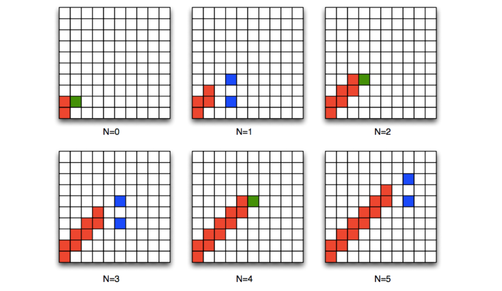

1. The numbers in the table below are the result of executing an algorithm that has one parameter N, a non-negative integer, and produces sequences of integers as outputs. For values of N from 0 to 5, the algorithm produces the following sequences of numbers as outputs.

| N | output                              |
| - | ----------------------------------- |
| 0 | 0 2                                 |
| 1 | 3 5 7 9                             |
| 2 | 6 8 10 12 14 16                     |
| 3 | 9 11 13 15 17 19 21 23              |
| 4 | 12 14 16 18 20 22 24 26 28 30       |
| 5 | 15 17 19 21 23 25 27 29 31 33 35 37 |

Determine the algorithm that was used to generate the numbers in this table, and

- Write it down.
- Execute it for N = 6, and write down your result.

What is the sequence of numbers for N = 6? (Give your answer as integers separated by single spaces.)

    - 接收一个非负整数N，从0到（N+1)*2（不包含后端），称作第i轮
		每一轮都输出3*N + 2*i

    - 18 20 22 24 26 28 30 32 34 36 38 40 42 44

2. The diagrams shown below are the result of executing an algorithm with one parameter N, a non-negative integer, that colors boxes on a 10 by 10 grid. For values of N from 0 to 5, the algorithm produces the following patterns:

3. The numbers in the table below are the result of executing an algorithm that has one parameter N, a non-negative integer, and produces sequences of integers as outputs. For values of N from 0 to 5, the algorithm produces the following sequences of numbers as outputs.

| N | output              |
| - | ------------------- |
| 0 |                     |
| 1 | 0 1                 |
| 2 | 0 2 2 3             |
| 3 | 0 2 4 3 4 5         |
| 4 | 0 2 4 6 4 5 6 7     |
| 5 | 0 2 4 6 8 5 6 7 8 9 |

Determine the algorithm that was used to generate the numbers in this table, and

1. Write it down.
2. Execute it for N = 6, and write down your result.
3. Give your description of the algorithm to a friend who is not a programmer, and ask him or her to execute it for N = 6.

What is the sequence of numbers for N = 6? (Give your answer as integers separated by single spaces.)

0 2 4 6 8 10 6 7 8 9 10 11
